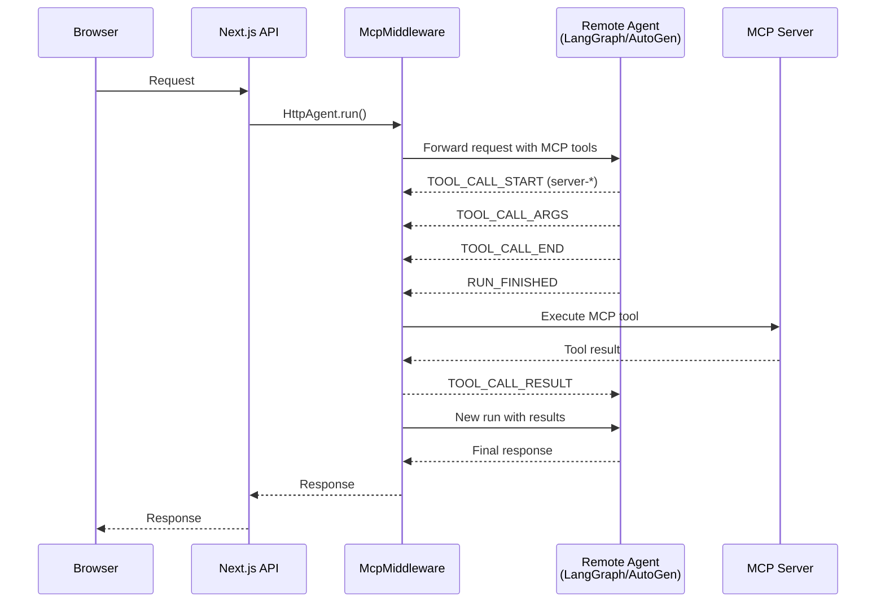

The AG-UI adapter and middleware enable seamless execution of MCP tools with remote agents (e.g., Python LangGraph, AutoGen, or CopilotKit).

## Installation

```bash
npm install @mcp-ts/sdk @ag-ui/client rxjs
```

## AG-UI Adapter

The `AguiAdapter` converts MCP tools into the AG-UI protocol format.

```typescript
import { MultiSessionClient } from '@mcp-ts/sdk/server';
import { AguiAdapter } from '@mcp-ts/sdk/adapters/agui-adapter';

const client = new MultiSessionClient('user_123');
await client.connect();

const adapter = new AguiAdapter(client);

// Get tools with handlers for server-side execution
const tools = await adapter.getTools();

// Get tool definitions (JSON Schema) for remote agents
const toolDefinitions = await adapter.getToolDefinitions();
```

---

## AG-UI Middleware

The AG-UI middleware enables server-side execution of MCP tools. This is essential when your agent runs on a separate backend but needs to execute MCP tools that require server-side access (like database or file system access).

### How It Works



### Usage

```typescript
import { NextRequest } from "next/server";
import { HttpAgent } from "@ag-ui/client";
import { AguiAdapter } from "@mcp-ts/sdk/adapters/agui-adapter";
import { createMcpMiddleware } from "@mcp-ts/sdk/adapters/agui-middleware";

export const POST = async (req: NextRequest) => {
  // Create remote agent connection
  const mcpAssistant = new HttpAgent({
    url: "http://127.0.0.1:8000/agent",
  });

  // Connect to MCP servers
  const { MultiSessionClient, getElicitationBroker } = await import("@mcp-ts/sdk/server");
  const identity = "user_123";
  const client = new MultiSessionClient(identity, {
    onElicitationRequest: async (params) =>
      getElicitationBroker().request({
        identity,
        sessionId: params.sessionId,
        serverId: params.serverId,
        mode: params.mode,
        message: params.message,
        requestedSchema: params.requestedSchema,
        url: params.url,
      }),
  });
  await client.connect();

  // Create adapter and get tools
  const adapter = new AguiAdapter(client);
  const mcpTools = await adapter.getTools();

  // Add middleware to intercept and execute MCP tools
  mcpAssistant.use(createMcpMiddleware({
    tools: mcpTools,
    elicitation: { identity },
  }));
  
  // Run the agent...
};
```

### Event Flow

The middleware intercepts AG-UI events and executes MCP tools:

| Event | Description |
|-------|-------------|
| `TOOL_CALL_START` | Records tool name and ID, marks MCP tools as pending |
| `TOOL_CALL_ARGS` | Accumulates streamed arguments |
| `TOOL_CALL_END` | Marks tool call as complete |
| `RUN_FINISHED` | Executes pending MCP tools, emits results, triggers new run |
| `CUSTOM` (`mcp_elicitation`) | Emitted when an MCP tool requests elicited user input |
| `TOOL_CALL_RESULT` | Emitted by middleware with MCP tool results |

### Elicitation Flow

When an MCP server calls `elicitation/create`, the middleware emits a structured AG-UI `CUSTOM` event named `mcp_elicitation` and keeps the MCP tool pending. The UI should render the form from `event.value.requestedSchema`, then submit the structured response with `mcpClient.respondToElicitation(event.value.elicitationId, action, data)`. That response resolves the original MCP tool call directly; it should not be sent back as a chat message.

```typescript
agent.subscribe({
  onCustomEvent({ event }) {
    if (event.name !== "mcp_elicitation") return;

    // Render event.value.message and event.value.requestedSchema.
    // On submit:
    mcpClient.respondToElicitation(
      event.value.elicitationId,
      "accept",
      formData
    );
  },
});
```

### Configuration Options

```typescript
createMcpMiddleware({
  tools: mcpTools,        // Pre-loaded tools with handlers
  elicitation: {
    identity: "user_123",  // Optional filter for multi-user servers
    sessionId: "...",      // Optional MCP session filter
    serverId: "...",       // Optional MCP server filter
  },
});
```
