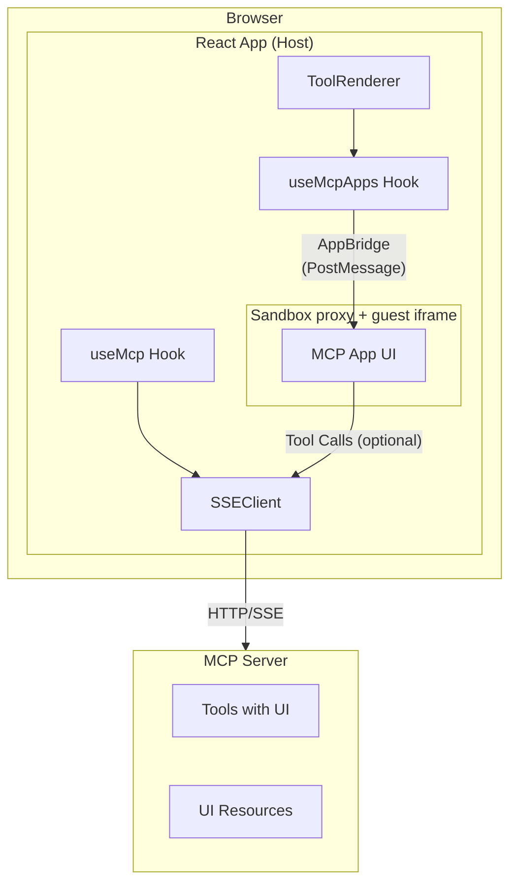

# MCP Apps

MCP Apps let MCP servers ship interactive UIs (HTML + AppBridge) for tools. The host loads that UI in a **sandboxed iframe**, then syncs tool **input**, **results**, **streaming partial input**, **cancellation**, and **host context** (theme, display mode, etc.) over the **AppBridge** protocol (`@modelcontextprotocol/ext-apps`).

## Overview

When a tool advertises a UI resource URI, `@mcp-ts/sdk` can render it via `useMcpApps` and `McpAppRenderer`. For `ui://` and `mcp-app://` resources (and any path where HTML is injected), you must provide a **`sandbox`** configuration pointing at a **sandbox proxy page** you serve from your app (see [Sandbox proxy](#sandbox-proxy)). Tool calls from the guest can be forwarded to your `SSEClient` automatically, or intercepted with **`onCallTool`** / **`onReadResource`** and related callbacks.



## Key features

- **Sandbox proxy** — Injected HTML loads through a dedicated proxy page; CSP can be passed via query string and applied inside the guest document.
- **Resource preloading** — `useMcp` preloads UI resources when tools are discovered (`SSEClient.preloadToolUiResources`), so apps open faster.
- **Host ↔ guest sync** — Tool input, final result, `toolInputPartial`, `toolCancelled`, merged `hostContext` (including `displayMode` for inline/fullscreen).
- **Mediation hooks** — Optional `onCallTool`, `onReadResource`, `onFallbackRequest`, `onMessage`, `onOpenLink`, etc., instead of automatic forwarding.
- **Fullscreen** — Guest `requestDisplayMode` can drive the browser Fullscreen API (handled inside `McpAppRenderer`).

## Sandbox proxy

Hosts must ship a small static page (for example copy [`examples/agents/public/sandbox.html`](https://github.com/zonlabs/mcp-ts/tree/main/examples/agents/public/sandbox.html)) that:

- Listens for the sandbox-ready handshake and HTML injection messages from the SDK.
- For `contentType=rawhtml`, writes guest HTML into an inner iframe and optionally applies CSP from the `csp` query parameter (JSON object → `Content-Security-Policy` meta).

Point `sandbox.url` at that page, typically with `?contentType=rawhtml`:

```tsx
import { DEFAULT_MCP_APP_CSP } from "@mcp-ts/sdk/client/react";

sandbox={{
  url: "/sandbox.html?contentType=rawhtml",
  csp: DEFAULT_MCP_APP_CSP,
}}
```

You can extend `DEFAULT_MCP_APP_CSP` (for example narrow or widen `connect-src`) per deployment.

## Quick start

### 1. MCP connection

Same as the rest of the React client: `useMcp`, connect to your server, expose `mcpClient` (for example via context). See the [React guide](./react.md).

### 2. Render MCP Apps on tool calls

Pass **`sandbox`** on every `McpAppRenderer` that loads server UI resources (HTML injection path):

```tsx
import { useRenderToolCall } from "@copilotkit/react-core";
import { useMcpApps, DEFAULT_MCP_APP_CSP } from "@mcp-ts/sdk/client/react";
import { useMcpContext } from "./mcp-context";

function ToolRenderer() {
  const { mcpClient } = useMcpContext();
  const { McpAppRenderer } = useMcpApps(mcpClient);

  useRenderToolCall({
    name: "*",
    render: ({ name, args, result, status }) => (
      <McpAppRenderer
        name={name}
        input={args}
        result={result}
        status={status === "complete" || status === "inProgress" || status === "executing" ? status : "executing"}
        sandbox={{
          url: "/sandbox.html?contentType=rawhtml",
          csp: DEFAULT_MCP_APP_CSP,
        }}
      />
    ),
  });

  return null;
}
```

`McpAppRenderer` resolves the UI URI from the tool name using `mcpClient.connections` (see [Tool metadata](#tool-metadata)). You can override the URI or pass raw HTML with `toolResourceUri` / `html`.

### 3. Optional: streaming and cancellation

If your agent streams tool arguments or can cancel a run, pass through:

```tsx
<McpAppRenderer
  name={name}
  input={args}
  result={result}
  status={status}
  sandbox={{ url: "/sandbox.html?contentType=rawhtml", csp: DEFAULT_MCP_APP_CSP }}
  toolInputPartial={streamingArgsPartial}
  toolCancelled={wasCancelled}
/>
```

### 4. Optional: host context and mediation

```tsx
<McpAppRenderer
  name={name}
  input={args}
  result={result}
  status={status}
  sandbox={{ url: "/sandbox.html?contentType=rawhtml", csp: DEFAULT_MCP_APP_CSP }}
  hostContext={{ theme: "light", locale: "en-US" }}
  onCallTool={async ({ name, arguments: args }) => {
    // Custom path: validate, then call your backend, etc.
    return { /* CallToolResult-shaped */ };
  }}
/>
```

If `onCallTool` / `onReadResource` are omitted, the host forwards to `mcpClient.sseClient` using the session inferred from the tool metadata.

## Tool metadata

`getAppMetadata` and `McpAppRenderer` look up UI resources using the first match on the tool name (prefixes such as `tool_<id>_` are stripped). A resource URI may come from:

- `tool.mcpApp.resourceUri`
- `tool._meta?.ui?.resourceUri`
- `tool._meta?.['ui/resourceUri']`

## Preloading

When the client receives tool discovery events, `useMcp` calls `SSEClient.preloadToolUiResources(sessionId, tools)` so `ui://` / `mcp-app://` HTML is often already cached before the user opens a tool.

For advanced use, `AppHost` also exposes `preload(tools)` (see [API reference](./api-reference.md#apphost-class)).

## API summary

### `useMcpApps(mcpClient)`

```typescript
function useMcpApps(mcpClient: McpClient | null): {
  getAppMetadata: (toolName: string) => McpAppMetadata | undefined;
  McpAppRenderer: React.NamedExoticComponent<McpAppRendererProps>;
};
```

- **`getAppMetadata`** — Returns `{ toolName, resourceUri, sessionId }` when the tool has a UI URI. Use for conditional UI; rendering does not require calling it first.
- **`McpAppRenderer`** — Memoized component tied to the `mcpClient` you passed into `useMcpApps`. Pass per-invocation props (`name`, `input`, `result`, `status`, etc.).

### `McpAppRendererProps`

| Prop | Type | Description |
|------|------|-------------|
| `name` | `string` | Tool name (matched against connection tools). |
| `input` | `Record<string, unknown>?` | Tool arguments; sent with `sendToolInput` after launch. |
| `result` | `unknown?` | Final tool result; sent when `status === 'complete'`. |
| `status` | `'executing' \| 'inProgress' \| 'complete' \| 'idle'` | Optional; default `'idle'`. |
| `toolResourceUri` | `string?` | Override UI resource URI from metadata. |
| `html` | `string?` | Raw HTML instead of fetching `toolResourceUri`. |
| `sandbox` | `SandboxConfig?` | **Required** for injected HTML: `{ url, csp?, permissions? }`. |
| `hostContext` | `Record<string, unknown>?` | Merged with defaults; `displayMode` is set by the renderer. |
| `toolInputPartial` | `any?` | Streamed partial input (`sendToolInputPartial`). |
| `toolCancelled` | `boolean?` | When truthy, sends tool cancelled to the guest. |
| `onCallTool` | `(params) => Promise<unknown>?` | Override automatic `callTool` forwarding. |
| `onReadResource` | `(uri: string) => Promise<{ contents: … }>?` | Override resource reads. |
| `onFallbackRequest` | `(request: any) => Promise<any>?` | AppBridge fallback JSON-RPC. |
| `onMessage` | AppBridge message handler | Guest `message` requests. |
| `onOpenLink` | AppBridge open-link handler | Guest link open requests. |
| `onLoggingMessage` | `(params) => void?` | Guest logging notifications. |
| `onSizeChanged` | `(params) => void?` | Guest size changes (iframe height adjusted automatically). |
| `onError` | `(error: Error) => void?` | Bridge / launch errors. |
| `className` | `string?` | Container class names. |
| `loader` | `React.ReactNode?` | Shown until the app finishes launching. |

Types such as `SandboxConfig` and `DEFAULT_MCP_APP_CSP` are exported from `@mcp-ts/sdk/client` / `@mcp-ts/sdk/client/react`.

## Low-level: `AppHost` and `useAppHost`

For custom layouts (your own iframe ref and lifecycle), use:

- **`AppHost`** from `@mcp-ts/sdk/client` — `constructor(client: AppHostClient | null, iframe: HTMLIFrameElement, options?: AppHostOptions)`, plus `start()`, `launch({ uri?, html? }, sessionId?)`, `preload(tools)`, `sendToolInput`, `sendToolResult`, `sendToolCancelled`, `sendToolInputPartial`, `setHostContext`.
- **`useAppHost`** from `@mcp-ts/sdk/client/react` — Wires an `AppHost` to a React `iframe` ref; passes `AppHostOptions` through. **Note:** today the hook only constructs the host when `client` is non-null; prefer `McpAppRenderer` unless you always have a connected `SSEClient`.

See the [API reference](./api-reference.md#apphost-class) for full `AppHostOptions`.

## Module exports

From **`@mcp-ts/sdk/client`**:

- `AppHost`, `DEFAULT_MCP_APP_CSP`, `APP_HOST_PROTOCOL`, `APP_HOST_DEFAULTS`, `SSEClient`, …

From **`@mcp-ts/sdk/client/react`**:

- `useMcp`, `useMcpApps`, `useAppHost`, `McpAppRendererProps`, `McpAppMetadata`, and re-exports from the client entry (including `AppHost`, `DEFAULT_MCP_APP_CSP`, …).

## Server-side tool declaration

Tools should advertise a UI resource (example patterns vary by server SDK):

```python
# Illustrative: attach metadata your MCP stack supports
get_time._meta = {
    "ui": {
        "resourceUri": "ui://get-time/mcp-app.html"
    }
}
```

The host must be able to `readResource` that URI for the correct session (automatic when using default forwarding and a connected `SSEClient`).

## Troubleshooting

- **Blank app / launch error** — Ensure `sandbox.url` is reachable and returns the proxy page; for HTML injection, include `contentType=rawhtml` if your proxy expects it.
- **CSP blocks scripts or APIs** — Adjust `sandbox.csp` (start from `DEFAULT_MCP_APP_CSP` and tighten or extend `connect-src` / `script-src` as needed).
- **Tool not found** — Confirm `name` matches the tool after prefix stripping and that `connections` includes the tool with a UI URI.
- **No automatic forwarding** — If you omit `onCallTool` but the SSE client is disconnected, guest tool calls fail until the client is connected or you supply handlers.

## Next steps

- [React guide](./react.md) — Connection setup and `useMcp`.
- [API reference](./api-reference.md) — `useMcpApps`, `AppHost`, `SSEClient`.
- [Examples](https://github.com/zonlabs/mcp-ts/tree/main/examples) — e.g. `examples/agents` with `sandbox.html` and `ToolRenderer`.
- [MCP App host comparison](./mcp-app-host-comparison.md) — `mcp-ts` vs `@mcp-ui/client`.
