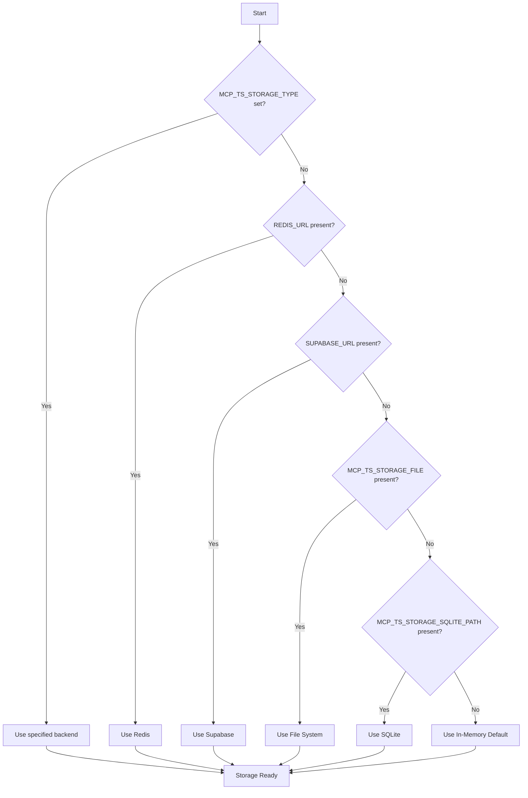

The library supports multiple storage backends for session persistence, allowing you to choose the best option for your deployment environment.

## Automatic Backend Selection

The library automatically selects the appropriate storage backend using this priority:



**Priority Order:**

1. **Explicit**: If `MCP_TS_STORAGE_TYPE` is set, use that backend
2. **Auto-detect Redis**: If `REDIS_URL` is present, use Redis
3. **Auto-detect Supabase**: If `SUPABASE_URL` is present, use Supabase
4. **Auto-detect File**: If `MCP_TS_STORAGE_FILE` is present, use File
5. **Auto-detect SQLite**: If `MCP_TS_STORAGE_SQLITE_PATH` is present, use SQLite
6. **Default**: Fall back to In-Memory storage

## Backend Comparison

| Feature | Redis | Supabase | SQLite | File System | In-Memory |
|---------|----------|----------|----------|----------------|--------------|
| **Persistence** | Yes | Yes | Yes | Yes | No |
| **Distributed** | Yes | Yes | No | No | No |
| **Auto-Expiry** | Yes (TTL) | Yes (Manual) | Yes (Manual) | No | No |
| **Performance** | Fast | Fast | Very Fast | Medium | Fastest |
| **Setup** | External | Cloud | Native | Built-in | Built-in |
| **Serverless** | Yes | Recommended | Limited | No | Yes |
| **Production** | Recommended | Recommended | Single-instance | Not recommended | Not recommended |

## Custom Backend Implementation

You can use specific storage backends directly:

```typescript
import { 
  RedisStorageBackend,
  MemoryStorageBackend,
  FileStorageBackend 
} from '@mcp-ts/sdk/server';
import { Redis } from 'ioredis';

// Custom Redis instance
const redis = new Redis({
  host: 'localhost',
  port: 6379,
  password: 'secret',
});
const redisStorage = new RedisStorageBackend(redis);

// Custom file path
const fileStorage = new FileStorageBackend({ 
  path: '/var/data/sessions.json' 
});
await fileStorage.init();

// In-memory for testing
const memoryStorage = new MemoryStorageBackend();
```

## Session Data Structure

All backends store the same session data structure:

```typescript
interface SessionData {
  sessionId: string;
  identity?: string;
  serverId?: string;
  serverName?: string;
  serverUrl: string;
  callbackUrl: string;
  transportType: 'sse' | 'streamable_http';
  active: boolean;
  createdAt: number;
  headers?: Record<string, string>;
  // OAuth data
  tokens?: OAuthTokens;
  clientInformation?: OAuthClientInformation;
  codeVerifier?: string;
  clientId?: string;
}
```
